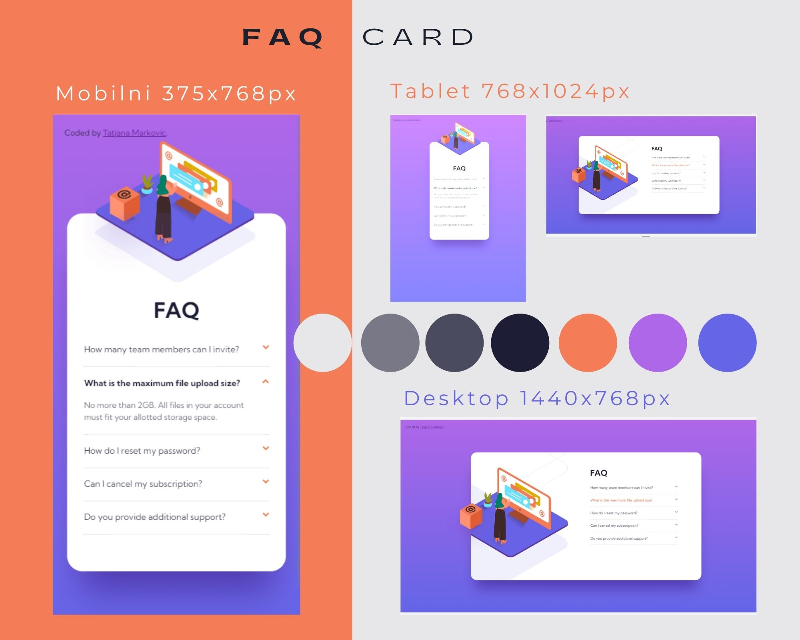
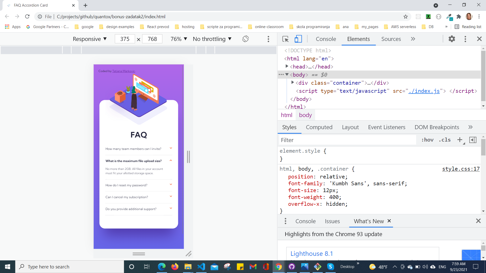
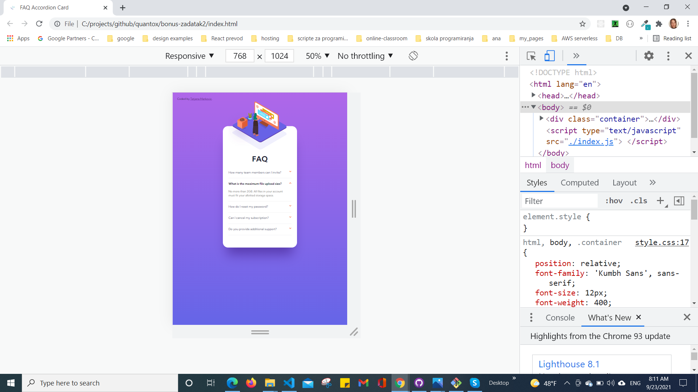
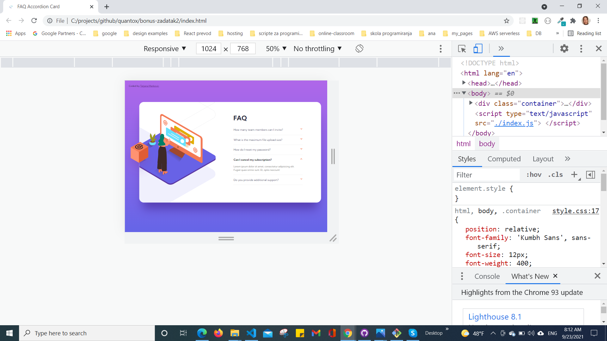
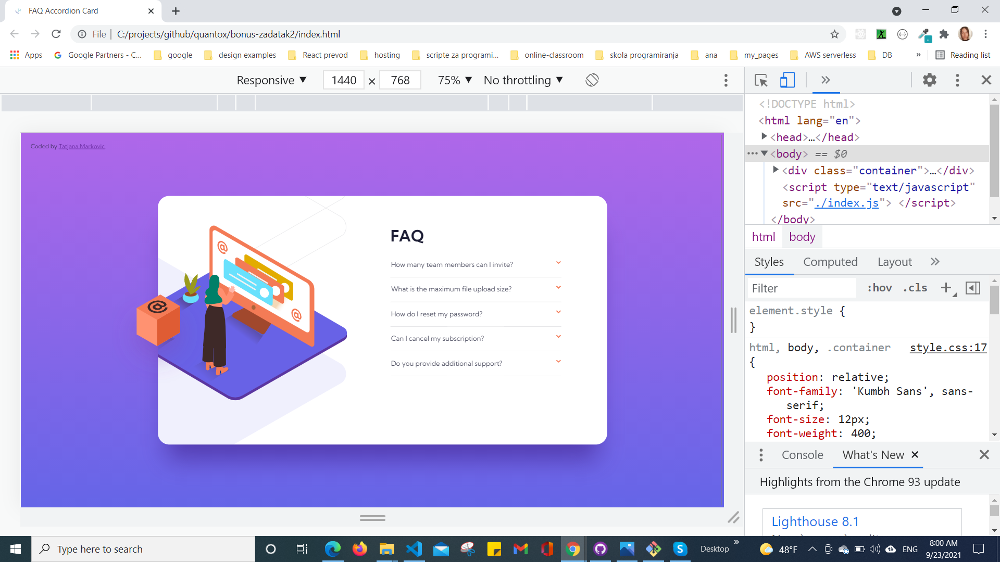
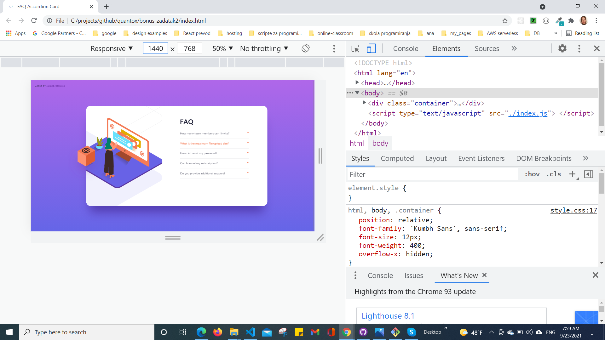

# FAQ accordion

## Table of contents

  - [Overview](#overview)
  - [The challenge](#the-challenge)
  - [Screenshot](#screenshot)
  - [My process](#my-process)
  - [Built with](#built-with)
  - [Author](#author)
## Overview

### The challenge

Users should be able to:

- View the optimal layout for the component depending on their device's screen size
- See hover states for all interactive elements on the page
- Hide/Show the answer to a question when the question is clicked

### Screenshot

### Links

- Solution URL: [GitHub](https://github.com/tatjama/bonus-zadatak2)
- Preview URL: [Vercel](https://bonus-zadatak2-3g2m50fh5-tatjana.vercel.app/)
- Live Site URL: [Vercel](https://bonus-zadatak2.vercel.app/)

## My process

1. Create a new project 
2. Import starting code
3. Initializing git repositories main and development
4. Import git repositories to the Vercel project
5. Create HTML structure
6. Use Figma design tools for measurements
7. Create CSS Utility
8. Desktop CSS Style
9. Create Page behavior with JavaScript
10. Responsive breakpoints at 1000px
11. Compare original designs with my work
12. Create screenshots
13. Change README-template.md to README.md
14. Open Pull request
15. Solve Issue
16. Merge develop branch into master branch
### Built with

1. Semantic HTML5 markup
2. JavaScript
- Event click
- DOM manipulation
3. CSS custom properties:
- FlexBox
- Media queries
- Centering elements, content and text
- Multiple Background Images
- Element positioning
- Customize font,width and size
- Gradient
- Hover
## Author

- Website - [Tatjana Markovic](https://my-react-portfolio-tatjana.vercel.app/)
- LinkedIn - [Tatjana Marković](https://www.linkedin.com/in/tatjana-markovi%C4%87-919501189/)
- GitHub - [tatjama](https://github.com/tatjama)